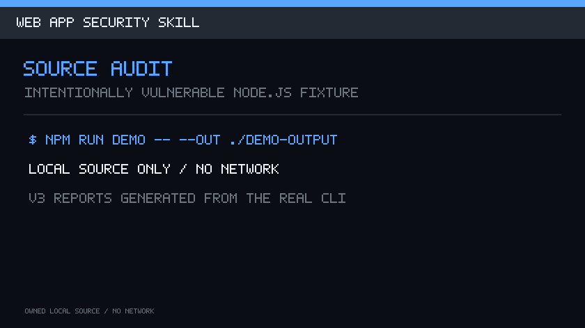

<h1 align="center">Web App Security Skill</h1>
<h3 align="center">用 AI coding agent 和可复现证据完成 Web 项目范围确认、检查、加固与复测</h3>

<p align="center">
  <a href="https://github.com/parousia8888/web-app-security-skill/tags"></a>
  <a href="https://github.com/parousia8888/web-app-security-skill/actions/workflows/ci.yml"></a>
  <a href="https://github.com/parousia8888/web-app-security-skill/actions/workflows/codeql.yml"></a>
  <a href="LICENSE"></a>
  <a href="#信任与-release-证据"></a>
</p>

<p align="center">
  <a href="#查看结果">Demo</a> ·
  <a href="#v051-新增内容">v0.5.1</a> ·
  <a href="#安装">安装</a> ·
  <a href="#执行第一个项目">首个项目</a> ·
  <a href="docs/tutorial.zh-CN.md">完整教程</a> ·
  <a href="#github-action">GitHub Action</a> ·
  <a href="#5-个普通项目旅程">项目旅程</a> ·
  <a href="README.md">English</a>
</p>

<p align="center">
  面向使用 AI coding agent 的 Web 产品作者与开发者，不要求具备攻防背景。先查看下方本地结果，
  然后安装并执行首个项目提示词。
</p>

> 把 Web 项目交给 AI coding agent，完成范围确认、风险检查、最小加固、复测和证据交付。

<p align="center">
  <a href="docs/demo-evidence.md"></a>
</p>

<p align="center"><a href="docs/demo-evidence.md">查看该演示对应的生成报告与补丁证据。</a></p>

## v0.5.1 新增内容

v0.5.1 是基于 v0.5.0“更多源码检测 + 看得懂的修复提案”能力边界的兼容性补丁：

- **源码覆盖更可靠：**`skills/*.yaml` 这类 JSX 子文本不会再被当成块注释；常见且能通过
  CPython 编译的 raw 正则字符串也不会再让整个文件的语言规则降级为 partial。
- **复核证据可重复验证：**五项目复核把作者原始报告的字节 SHA-256 与稳定语义摘要分开，
  第三方无需复现随机 ephemeral subject 也能校验规则集、finding 身份与状态。
- **TLS fixture 更隔离：**本地证书测试在选择自有 fixture CA 前清理继承的
  `SSL_CERT_FILE`。

检测和解释能力继续遵守 v0.5.0 合同：

- **自动源码规则增加：**20 条 stable built-in risk、2 条证据完整性规则、8 条 opt-in 外部 adapter
  规则。内置深度明确集中在 JavaScript/TypeScript 与 Python Web 代码。
- **同一问题讲两遍：**v3 源码 finding 保留行业术语和标准映射，同时用白话说明问题、可能后果，以及
  当前证据不能证明什么。
- **先给提案，不盲改：**报告列出替代方案、可能副作用、需要用户决定的事项、安全复测、功能复测和
  回滚条件。`repair-plan` 只创建私有审查记录，CLI 不直接修改项目。
- **普通项目证据：**v0.5.0 在 5 个固定 commit 项目上得到 43 条 pattern finding，人工逐条复核为
  11 条有用线索、27 条预期良性命中、1 条 unknown、4 条已确认的缺 lockfile 事实。这不等于 43 个
  漏洞，也不构成 precision/recall 指标。

准确支持范围见[兼容矩阵](docs/compatibility.md)、[稳定规则语料](docs/stable-rule-corpus.json)和
[普通项目复核](docs/case-studies/journeys/v0.5.0-review.md)。在 v0.5.1 公开资产完成发布后验证前，
下面的可信安装器仍默认选择已发布的 v0.5.0，并保留可显式安装的 v0.3.0 与 v0.4.0 信任路径。

## 查看结果

命令会检查一个故意留下不安全写法的本地源码文件，展示解释和修改提案，再分别执行安全复测与正常
功能测试。全程不访问外网，也不安装项目依赖。

| 输入 | Finding | 证据 | 可审查变更 | 复测 |
|---|---|---|---|---|
| `src/export-report.mjs` | OS command injection lead (CWE-78)，HIGH | `suspected`；未证明输入流和可达性 | 用 `execFile` 和分离参数取消 shell 解析；命令 quoting 与跨平台行为可能改变 | security `fixed`；functional `passed` |

```bash
git clone https://github.com/parousia8888/web-app-security-skill.git
cd web-app-security-skill
npm run demo -- --out ./demo-output
```

阅读[生成的加固前 / 变更建议 / 复测证据](docs/demo-evidence.md)，再检查
`demo-output/demo-result.json`、`summary.md`、`before.json`、`hardening.patch`、`after.json` 与
`functional-retest.txt`。所有公开 demo 事实都来自 `demo-result.json`；仓库门禁会重跑 fixture，
并在任一公开面不一致时失败。

完整的安装到卸载流程见经过测试的[第一个项目教程](docs/tutorial.zh-CN.md)。

## 安装

这条命令同时安装 Claude Code skill、Codex skill 和 `~/.local/bin/webapp-security` 普通 CLI。
若已有安装会直接拒绝；只有显式加入 `--force` 才会先生成带时间戳的备份再替换。该命令下载不可变
bootstrap 并在执行前验证 SHA-256，然后验证选定 release 的 manifest、checksums、SBOM、源码提交和
归档，再进入安装。

```bash
( set -eu; p="$(mktemp "${TMPDIR:-/tmp}/web-app-security-bootstrap.XXXXXX")"; trap 'rm -f "$p"' EXIT HUP INT TERM; curl --proto '=https' --proto-redir '=https' --tlsv1.2 --fail --silent --show-error --location --output "$p" 'https://raw.githubusercontent.com/parousia8888/web-app-security-skill/d9239deeb20d708948e80bcb3c09bd986a2b400c/scripts/bootstrap-install.sh?immutable=d9239deeb20d708948e80bcb3c09bd986a2b400c'; node -e 'const c=require("node:crypto"),f=require("node:fs"),p=process.argv[1],e=process.argv[2],a=c.createHash("sha256").update(f.readFileSync(p)).digest("hex");if(a!==e){console.error(`bootstrap SHA-256 mismatch: ${a}`);process.exit(1)}' "$p" '4dd81d1c49596e7a1c54b8ca009802bcd46da976cb02e9cdc576f0d3e5617fc5'; sh "$p" )
```

也可以只装单一入口：

```bash
sh bootstrap-install.sh --target claude
sh bootstrap-install.sh --target codex
sh bootstrap-install.sh --target cli
sh bootstrap-install.sh --target both   # Claude Code + Codex
```

简写示例以已经通过上方命令下载并验证 `bootstrap-install.sh` 为前提。显式版本、离线/人工验证、
attestation 及信任锚说明见[可信安装](docs/verified-installation.zh-CN.md)。系统支持范围与当前限制见
[兼容矩阵](docs/compatibility.md)。

查看版本、升级或卸载：

```bash
webapp-security version
# 对可识别的现有安装运行已验证 bootstrap，并选择 upgrade 模式。
sh bootstrap-install.sh --mode upgrade
webapp-security uninstall
```

`upgrade` 只替换带有 Web App Security Skill 可识别 marker（或已记录旧 Skill 身份）的安装，并保留
时间戳备份。`uninstall` 删除可识别的当前安装但保留这些备份。未知目录或 launcher 即使配合
`install --force` 也会被拒绝。

## 执行第一个项目

在 Claude Code 或 Codex 中打开目标仓库，然后发送：

```bash
webapp-security start .
```

命令会创建私有项目身份及 `.webapp-security/runs/<run-id>/security-scope.yml`，记录检测到的框架、
包管理器、lockfile 与部署/配置路径，全程不访问网络。检查 scope 后，再发送：

```text
在这个仓库使用 $web-app-security。先只执行源码与本地检查，记录范围和假设；把每项结果标为 confirmed、suspected、unknown 或 not_applicable；准备最小且可审查的加固补丁，未经批准不应用高风险或生产变更；复测每项已应用修复，最后列出已修复、仍存在和未覆盖的风险。
```

随后可运行确定性源码路径：

```bash
webapp-security audit .webapp-security/runs/<run-id> --fail-on high
webapp-security explain <finding-id> --report .webapp-security/runs/<run-id>/report.json
webapp-security repair-plan <finding-id> \
  --report .webapp-security/runs/<run-id>/report.json --out ./repair-review
webapp-security start . --run-id <retest-run-id>
webapp-security retest .webapp-security/runs/<retest-run-id> \
  --baseline .webapp-security/runs/<run-id>/report.json
```

默认使用内置、无网络的源码 adapter。外部 adapter 必须显式选择：

```bash
webapp-security doctor . --adapter all --json
webapp-security audit . --adapter checkov --adapter gitleaks --adapter opengrep --adapter osv --fail-on never
```

已测试版本为 Checkov `3.3.9`、Gitleaks `8.30.1`、Opengrep `1.27.0` 和 OSV-Scanner `2.5.0`；CLI 与
Action 都不会自动下载。Checkov 只运行三条固定的根目录 Dockerfile/GitHub Actions 规则，并使用
`--skip-download`；它可能向 PyPI 查询版本元数据，但不会上传项目源码。Opengrep 只使用内置、摘要
固定的两条本地规则且不访问网络；OSV-Scanner 可能查询公共 OSV 数据库。所有 adapter 都不会执行
项目依赖。Compose、Terraform、Kubernetes 和 Checkov 的其他规则不属于 stable 覆盖。外部结果要影响阻断退出码前，还必须在使用方仓库接受
[`docs/alert-policy.md`](docs/alert-policy.md) 中的责任，并传入
`--acknowledge-alert-policy`。版本、失败与脱敏语义见
[`adapter protocol`](docs/adapter-protocol.md)。

每次源码 audit 会写出 v3 JSON、Markdown、HTML、SARIF、JUnit、SHA-256 sidecar 和
`proposed.patch`。每条源码 finding 同时保留专业术语和通俗解释，并说明可能后果、证据边界、待审查
提案、副作用、安全复测、功能复测、回滚条件与需要用户决定的事项。直接对项目执行的一次性 audit
使用 ephemeral identity，不能作为复测 baseline。`fixed` 必须同时满足 persisted subject/scope
相同、rule 兼容、本次 coverage 已完成且条件明确不存在。命令不会应用补丁，也不授予部署探测权限。

报告先按风险 domain，再按 evidence state，最后按 severity 汇总。默认 CI policy 只 gate 已确认的
HIGH `security_exposure` 与 `supply_chain` finding。现有 `--fail-on` 继续同时设置这两个 domain；
如需 gate 其他 domain，必须显式指定，例如：

```bash
webapp-security crawl --site https://example.com --out ./security-report \
  --fail-on high --fail-on-domain search_discoverability=high
```

可以组合多个 `--fail-on-domain <domain=threshold>`。有效 threshold 会写入 report。
[生成的 rule taxonomy](docs/rule-taxonomy.md)把 source rule 的 kind、family、language、domain、
severity、默认证据状态与标准引用分开记录。精确 stable source 数量和完整解释元数据来自机器可读的
[`stable-source-rules.json`](docs/stable-source-rules.json)：`main` 当前是 20 条 built-in 风险规则、
2 条 built-in 证据完整性规则和 8 条外部适配器风险规则，合计 30 条 stable 源码与部署策略规则。其中 JavaScript/TypeScript 与 Python
各有 8 条 built-in 风险规则，都是有边界的词法线索，覆盖危险执行、浏览器或框架配置、传输、
认证密钥与反序列化。它们不能证明输入流或运行时可达性，未经独立复现一律保持 `suspected`。

## 能力边界

能力使用两个互相独立的维度，避免把支撑工具计入漏洞检测覆盖：

- **类别：** 检测；证据与报告；生命周期与分发；或 Agent 方法论。
- **成熟度：** `stable`、`experimental`、`agent_guided` 或 `planned`。

当前 stable 检测家族包括窄范围内置源码 audit、显式启用的 Checkov、Gitleaks、Opengrep 与 OSV-Scanner
adapter、crawl boundary、crawler 身份验证、edge 验证和
只读 AWS inventory helper。项目识别、demo、报告 renderer、复测基础设施、安装器与 GitHub
Action 虽然都有测试，但不构成更多 detector 家族。API 授权、业务逻辑、LLM/OAuth、数据层和
更广的 AWS 审查仍属于 Agent
方法论，直到具体 adapter 获得回归证据。

[生成的能力矩阵](docs/capabilities.md)为每项类别与成熟度声明链接证据。结果只使用 `confirmed`、
`suspected`、`unknown`、`not_applicable`；无法执行的检查不是通过。安装 Skill 不代表项目已经安全。

## 确定性工具

可以让 Claude Code 或 Codex 调用 `web-app-security`，也可以直接运行相同的确定性工具：

```bash
# 无网络项目识别与版本化 scope
webapp-security start .

# 只读源码 audit、finding 解释与强制 baseline 复测
webapp-security audit .webapp-security/runs/<run-id> --fail-on high
webapp-security doctor . --adapter all
webapp-security audit . --adapter checkov --adapter gitleaks --adapter opengrep --adapter osv --fail-on never
webapp-security explain <finding-id> --report <report.json>
webapp-security start . --run-id <retest-run-id>
webapp-security retest .webapp-security/runs/<retest-run-id> \
  --baseline <report.json> --fail-on high

# 历史 v1 报告保持不可比较；移动/clone 的项目必须显式绑定
webapp-security migrate-report <v1-report.json> --scope <security-scope.yml> \
  --acknowledge-subject <subject-id> --out <new-directory>
webapp-security rebind <moved-project> --scope <security-scope.yml> \
  --acknowledge-subject <subject-id>

# 默认被动：爬取边界与 crawler 可达性
webapp-security crawl --site https://example.com --out ./security-report

# 敏感路径主动探测：必须同时具备所有权/书面授权并显式确认
webapp-security crawl --site https://example.com --out ./security-report \
  --active-probe --acknowledge-authorization

# crawler 身份：精确产品 IP 段或 FCrDNS，不能只信 UA 字符串
webapp-security verify-crawler --ip 66.249.66.1 --ua Googlebot --ranges

# 默认被动：header、跳转、证书和 TLS 策略
webapp-security verify-edge --site https://example.com

# 只读 AWS 姿态清点
webapp-security aws --profile default --region us-east-1 --out ./security-report
```

主动限流复测同样要求 `--acknowledge-authorization`。网络或证据源失败会得到 `unknown` 和非零退出，
不会被描述成安全。

Source 结论使用 finding/report v3，新 demo 内部的 before/after 源码报告也使用 v3。Crawl、crawler
identity、edge 与 AWS 仍使用 v2；demo 的小型 `demo-result.json` 事实 schema 与两种 report schema
分开。两个 report 版本保留相同的 coverage、证据状态、policy 与退出码语义。Report bundle 和各工具的
observation 会先在内存中脱敏，再以私有 staging 文件写入目标目录并整套提交，不覆盖已有证据；
renderer 或可处理的写入失败会回滚，不留下半套新 bundle。历史 v1 报告只用于展示、release 校验
与显式的不可比较迁移，不能作为可比较 baseline。符合 subject、scope、rule 和 coverage 兼容条件的
persisted v2 源码 baseline 可继续读取，并只在内存中升级后参与 v3 对比，原文件不会被改写。

## GitHub Action

Composite Action 保持 v0.3 crawl 输入与输出兼容。Crawl mode 默认被动，且必须确认部署授权：

```yaml
- name: Audit public crawl boundary
  uses: parousia8888/web-app-security-skill@778a7ba73588cdab1d9df281ab362f4fe0925189
  with:
    site: https://example.com
    acknowledge-authorization: true
    active-probe: false
    fail-on: high
```

需要可重复 CI 时使用上面的 v0.5.0 不可变 commit。签名的稳定大版本别名现已指向同一份
v0.5.0 源码，并通过外部 consumer 的 crawl 与 source 两种模式：

```yaml
uses: parousia8888/web-app-security-skill@v1
```

Source mode 默认只用内置 adapter。v0.5.0 不可变 Action 运行 v3 源码合同和 stable v0.5.0
规则语料。外部二进制必须由调用方固定版本并安装，Action 不会下载：

```yaml
- name: Audit source
  uses: parousia8888/web-app-security-skill@778a7ba73588cdab1d9df281ab362f4fe0925189
  with:
    mode: source
    project: .
    adapters: builtin
    fail-on: high
```

移动的 `v1` tag 只在版本化 release 通过真实 consumer workflow 后更新。以后接受更新前应检查
release note；工作流不能随版本移动时，使用上面的完整 commit。

## 信任与 release 证据

- CI 覆盖 Ubuntu/macOS x Node 22/24、确定性 HTTP/HTTPS fixture 和 Bash 3.2 smoke test。
- release 与 CodeQL workflow 的第三方 Action 使用完整 commit SHA。
- tag 必须同时匹配 `VERSION`、changelog 和该版本的证据文件；tag 带签名，release 记录来源 commit。
- release 产物包含可复现源码包、SPDX 2.3 SBOM、`SHA256SUMS` 与 GitHub build provenance attestation。
  CI 会构建两次并逐字节比较全部产物，再在禁止网络的隔离 HOME 中从解包产物执行完整生命周期。
- [`SECURITY.md`](SECURITY.md)、[威胁模型](docs/threat-model.md)、
  [误报政策](docs/false-positive-policy.md)和[兼容矩阵](docs/compatibility.md)可供独立复核。

验证下载的 release 产物：

```bash
sha256sum -c SHA256SUMS
gh attestation verify web-app-security-skill-*.tar.gz \
  --repo parousia8888/web-app-security-skill
git -c gpg.ssh.allowedSignersFile=.github/release-signers verify-tag v0.5.0
```

## 5 个普通项目旅程

原 v0.4.0 旅程保留完整 v2 built-in/Gitleaks/OSV 证据。独立的
[v0.5.0 built-in 复核](docs/case-studies/journeys/v0.5.0-review.md)对同一批固定 commit 执行更广的
v3 JavaScript/TypeScript 与 Python 规则，并人工归类每条 finding。两个版本都没有探测线上实例或执行
项目依赖。

| 项目 | 证据结果 | 人工结论 |
|---|---|---|
| [Linkwarden](docs/case-studies/journeys/linkwarden.md) | v3：6 suspected | 复核 JSDOM、DOMPurify 和常量内容后，6 条为预期良性命中 |
| [Healthchecks](docs/case-studies/journeys/healthchecks.md) | v3：5 suspected | 4 条 response encoding 有用线索；1 条 opt-in shell 为预期良性命中 |
| [Open WebUI](docs/case-studies/journeys/open-webui.md) | v3：6 suspected；1 unknown | 3 条有用线索；3 条预期良性；tokenizer 失败保留 unknown |
| [Uptime Kuma](docs/case-studies/journeys/uptime-kuma.md) | v3：4 confirmed fact；21 suspected | 4 条有用线索；17 条预期良性；confirmed 只是 lockfile 卫生事实，不是 4 个应用漏洞 |
| [Mealie](docs/case-studies/journeys/mealie.md) | v3：0 finding | 没有配置中的 pattern 命中，不等于项目安全 |

阅读[结构化旅程、精确命令与证据边界](docs/case-studies/journeys/README.md)。零 finding 与误报关闭
同样保留；这里不计算 precision 分数。Uptime Kuma 与 Mealie 和下方方法论 corpus 使用相同 commit，
因此是两种证据视图，不是 10 个互不重复的项目。

另有 **5 个既有源码方法论案例**：三个故意脆弱基准与两个生产项目，作为独立 corpus 保留。

| 项目 | 证据结果 |
|---|---|
| [OWASP Juice Shop](docs/case-studies/juice-shop.md) | 确认故意存在的 SQL 注入，并对应到上游 prepared statement 修复 |
| [OWASP NodeGoat](docs/case-studies/nodegoat.md) | 确认故意存在的服务端 `eval`、IDOR、开放跳转 |
| [DVWA](docs/case-studies/dvwa.md) | 确认 low/impossible 两档 SQLi、XSS、命令注入控制对照 |
| [Uptime Kuma](docs/case-studies/uptime-kuma.md) | SSRF 形态的出站 sink 被判为产品能力，不计漏洞 |
| [Mealie](docs/case-studies/mealie.md) | URL 抓取线索追踪到鉴权与私网 IP guard，不计漏洞 |

完整方法与限制见[案例总览](docs/case-studies/README.md)。这些案例验证方法论，不虚构一个尚非通用
SAST 引擎的 CLI 精度分数。

## 项目结构

阶段顺序是：Phase 0 授权范围 → 前端 → API → LLM/OAuth → 服务端源码 → 数据库隔离 → 供应链 →
蓝队检测 → 报告/补丁证据/复测。横向专题覆盖爬取边界、crawler 身份、source map/dotfile、
执行层、AWS、遗漏攻击面、回归门禁与安全部署。入口在 [`SKILL.md`](SKILL.md)。

公开 [roadmap](ROADMAP.md) 将正确性建设与传播建设分开。新贡献者可从
[Good First Issues](docs/GOOD_FIRST_ISSUES.md)、issue forms 和 [`CONTRIBUTING.md`](CONTRIBUTING.md)
开始。误报报告必须提供脱敏的最小 fixture 和期望分类；敏感信息走 private vulnerability reporting。

[生成式 launch evidence](docs/launch-evidence.md)只汇集可复现的能力、demo、项目旅程、方法论案例和
release 事实。[发布素材包](docs/adoption/launch-brief.zh-CN.md)提供带证据链接的中英文渠道草稿，
以及可复用的公开案例/私下披露流程，但不声称外部发布已经发生。

MIT License。
